# IT Inventory Manager


A portable offline IT asset management system designed for small teams to track devices, assignments, and operational records without external infrastructure.

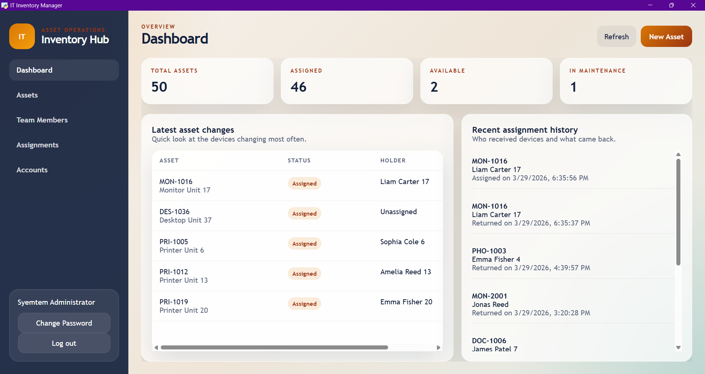

---

## Why This Project

This project was built to reflect real IT support workflows rather than a simple CRUD demo. It focuses on the kinds of tasks an IT specialist or support administrator handles daily:

- Tracking devices and asset tags  
- Assigning equipment to users  
- Managing account roles and password updates  
- Maintaining assignment history  
- Exporting operational records  
- Running fully offline in a portable environment  

---

## Highlights

- Fully offline, portable asset management system  
- Python + SQLite backend with local data storage  
- Desktop interface powered by `pywebview`  
- Asset, assignment, account, and team management  
- Advanced search, filtering, and sorting  
- CSV import/export and PDF report generation  
- Reusable field suggestions with inline CRUD  

---

## Key Capabilities

- Track and manage IT assets (laptops, phones, printers, etc.)  
- Assign and return devices with full history tracking  
- Manage user accounts and roles (Admin, User, Super Admin)  
- Maintain reusable field values for faster data entry  
- Generate reports and export operational data  

---

## Screenshots

### Login & Dashboard

<p align="center">
  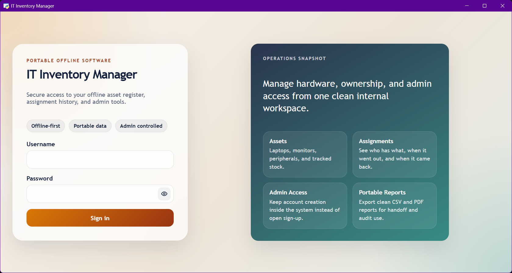
  
</p>

---

### Asset Management

<p align="center">
  
  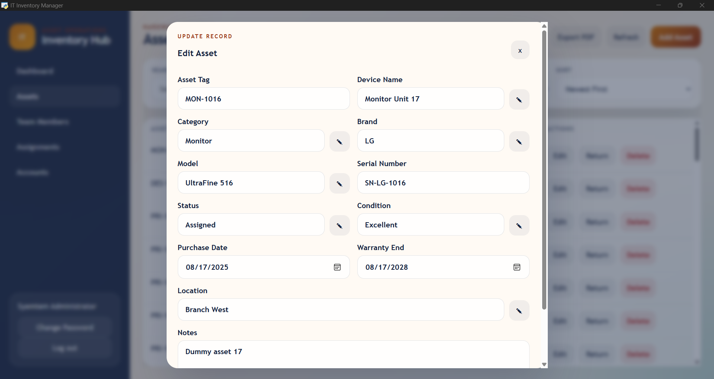
</p>

---

### Team Members

<p align="center">
  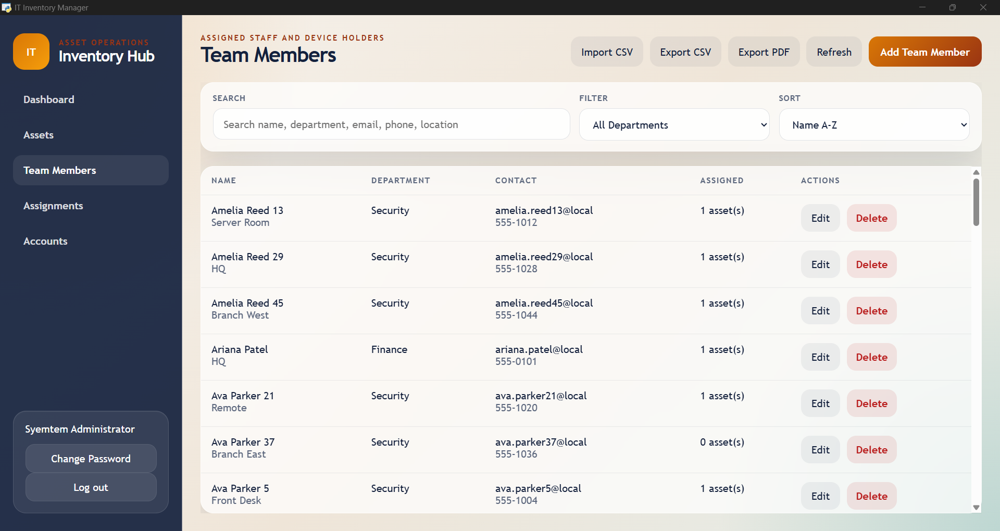
</p>

---

### Assignments (Check-in / Check-out)

<p align="center">
  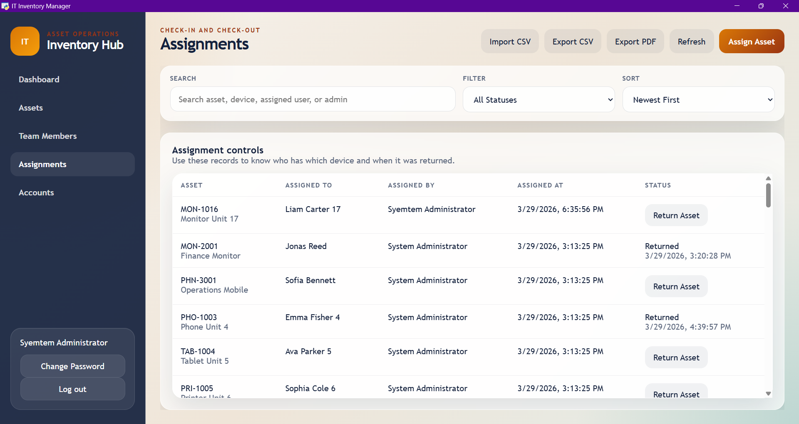
  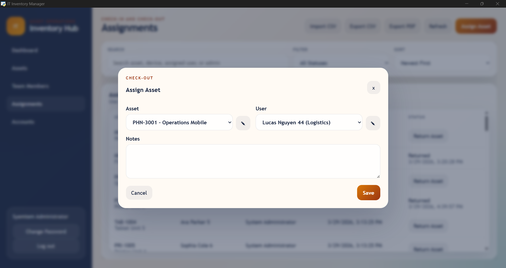
</p>

---

### Account Management

<p align="center">
  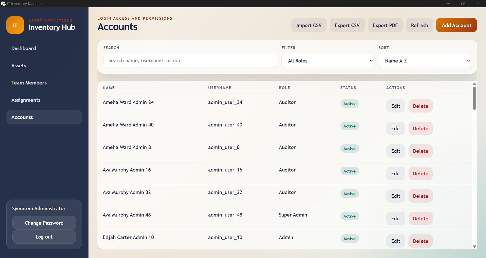
  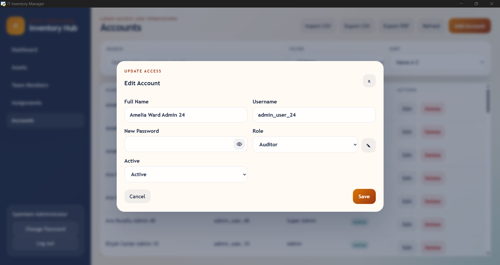
</p>

---

### System Controls

<p align="center">
  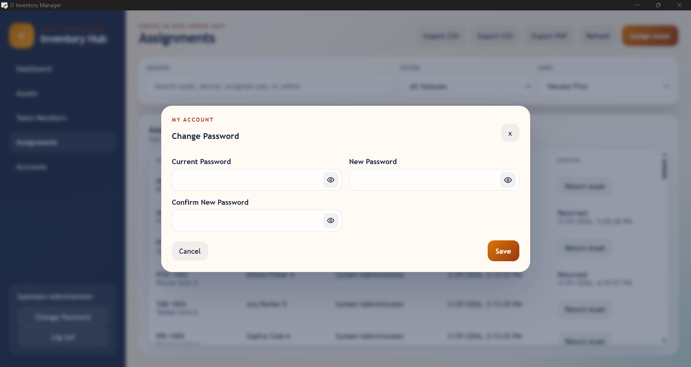
  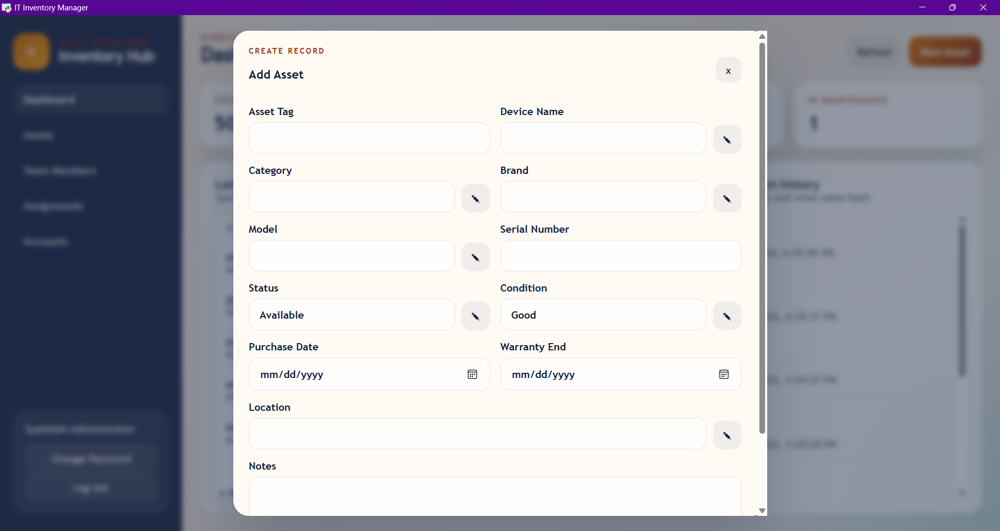
</p>

---

### Smart Field Management

<p align="center">
  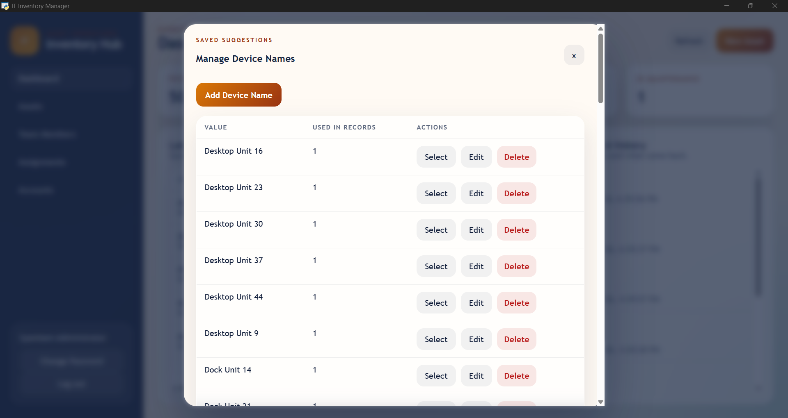
  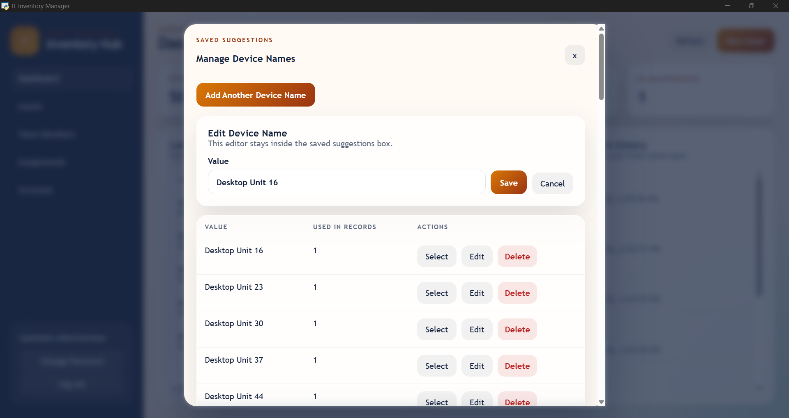
  <br><br>
  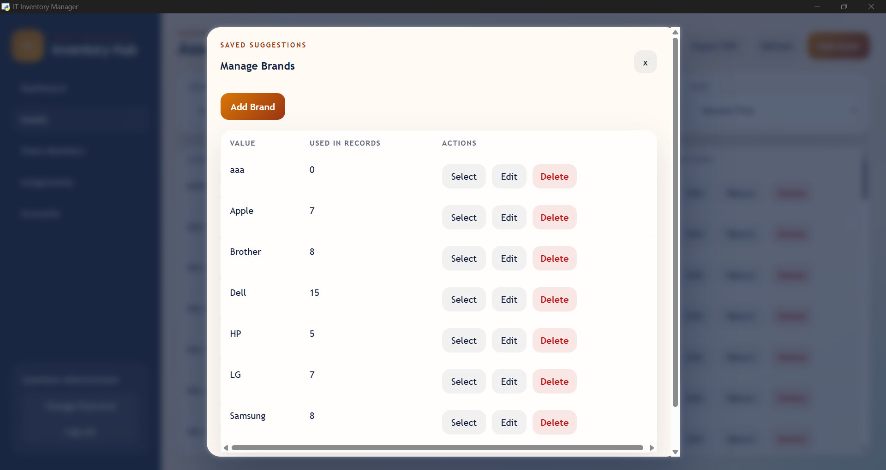
</p>

---

## Tech Stack

- Python  
- SQLite  
- HTML  
- CSS  
- Vanilla JavaScript  
- `pywebview`  
- `reportlab`  

---

## Main Features

- **Dashboard**  
  View asset counts, assignment history, and recent activity  

- **Asset Management**  
  Create, edit, assign, return, and manage inventory  

- **Team Members**  
  Maintain user/device-holder profiles  

- **Accounts & Roles**  
  Manage access levels and authentication  

- **Search & Filters**  
  Quickly find records across all modules  

- **Saved Suggestions**  
  Reuse common values (device, category, location, etc.)  

- **Import / Export**  
  CSV import/export and PDF reporting  

- **Password Controls**  
  Admin reset and user password updates  

---

## Run Options

### Option 1: Browser Mode

1. Install Python 3  
2. Install dependencies:

```bash
pip install -r requirements.txt
```

3. Start the app:

```bash
python app.py
```

4. Open http://127.0.0.1:8000  

---

### Option 2: Desktop Mode

1. Install Python 3  
2. Install dependencies:

```bash
pip install -r requirements.txt
```

3. Start the desktop app:

```bash
python desktop.py
```

---

### Windows Launchers

- `run.bat`: browser mode  
- `run_desktop.bat`: desktop mode  
- `app.pyw`: browser mode (no terminal window)  
- `desktop.pyw`: desktop mode (no terminal window)  

---

## Default Login Credentials

| Username | Password |
|----------|----------|
| admin    | admin    |

---

## First-Time Walkthrough

1. Sign in with the default admin account  
2. Open the Dashboard to review totals and activity  
3. Add team members  
4. Add assets (laptops, phones, etc.)  
5. Assign assets to users  
6. Manage accounts and roles  
7. Use search, filters, and sorting  
8. Manage saved field values using inline edit tools  
9. Export reports as CSV or PDF  

---

## Project Structure

- `app.py`: backend server and API routes  
- `desktop.py`: desktop launcher (`pywebview`)  
- `static/index.html`: UI layout  
- `static/styles.css`: styling  
- `static/app.js`: frontend logic  
- `data/`: local database storage  
- `recover_admin.py`: restore admin access  

---

## Portability

All data is stored locally in `data/inventory.db`, allowing the application to be moved by copying the project folder.

A separate portable runtime version (including Python) can also be created for full standalone use.